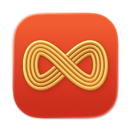

    
    <h1>Skein</h1>

Skein is a menu bar manager for macOS. It hides and shows menu bar items, and gives you a set of tools for arranging and customising the menu bar around them.

It is part of the [Ariadnev](https://ariadnev.com) ecosystem.

**Skein is derived from [Ice](https://github.com/jordanbaird/Ice) by Jordan Baird**, and the overwhelming majority of its source code originates there. Skein is an independent project rather than a maintained fork: it has its own name, releases, and direction, and it is not affiliated with or endorsed by the upstream project. It remains licensed under GPL-3.0, and Jordan Baird's copyright is preserved in [`LICENSE`](LICENSE). See [`docs/UPSTREAM.md`](docs/UPSTREAM.md) for the full provenance record.

## Install

Download the `Skein-<version>.zip` file from the [latest release](https://github.com/bavanchun/ariadnev-skein/releases/latest) and move the unzipped app into your `Applications` folder.

Skein is signed with a personal development certificate rather than a Developer ID, so on first launch macOS may require you to allow it explicitly in System Settings → Privacy & Security.

Skein needs Accessibility and Screen Recording permissions to manage and capture menu bar items.

## Features

### Menu bar item management

- [x] Hide menu bar items
- [x] "Always-hidden" menu bar section
- [x] Show hidden menu bar items when hovering over the menu bar
- [x] Show hidden menu bar items when an empty area in the menu bar is clicked
- [x] Show hidden menu bar items by scrolling or swiping in the menu bar
- [x] Automatically rehide menu bar items
- [x] Hide application menus when they overlap with shown menu bar items
- [x] Drag and drop interface to arrange individual menu bar items
- [x] Display hidden menu bar items in a separate bar (e.g. for MacBooks with the notch)
- [x] Search menu bar items
- [x] Menu bar item spacing (BETA)
- [ ] Profiles for menu bar layout
- [ ] Individual spacer items
- [ ] Menu bar item groups
- [ ] Show menu bar items when trigger conditions are met

### Menu bar appearance

- [x] Menu bar tint (solid and gradient)
- [x] Menu bar shadow
- [x] Menu bar border
- [x] Custom menu bar shapes (rounded and/or split)
- [ ] Remove background behind menu bar
- [ ] Rounded screen corners
- [ ] Different settings for light/dark mode

### Hotkeys

- [x] Toggle individual menu bar sections
- [x] Show the search panel
- [x] Enable/disable the Skein Bar
- [x] Show/hide section divider icons
- [x] Toggle application menus
- [ ] Enable/disable auto rehide
- [ ] Temporarily show individual menu bar items

### Other

- [x] Launch at login
- [x] Automatic updates
- [ ] Menu bar widgets

## Why does Skein only support macOS 14 and later?

Skein uses a number of system APIs that are available starting in macOS 14. As such, there are no plans to support earlier versions of macOS.

## Gallery

#### Show hidden menu bar items below the menu bar

#### Drag-and-drop interface to arrange menu bar items

#### Customize the menu bar's appearance

#### Menu bar item search

#### Custom menu bar item spacing

## Credits

Skein is a fork of [jordanbaird/Ice](https://github.com/jordanbaird/Ice) by Jordan Baird, licensed under GPL-3.0. All original functionality and the overwhelming majority of the source code originate from that project.

## License

Skein is available under the [GPL-3.0 license](LICENSE), inherited from Ice.
